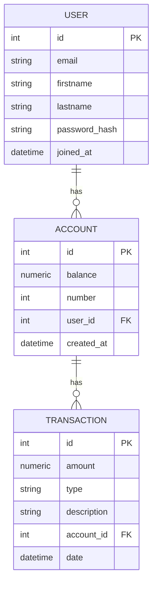

# Gemini Bank

## Disclaimer

This is a demo application for educational purposes only. It is not intended for production use. The application has not undergone a security audit and may contain vulnerabilities. Do not use real personal or financial information.

## Description

Gemini Bank is a simple web-based banking application built with Python and the Flask framework. It allows users to register, log in, create bank accounts, make deposits and transfers, and view their transaction history.

## Features

*   **User Authentication:** Secure user registration and login functionality.
*   **Account Management:** Create and manage multiple bank accounts.
*   **Transactions:** Perform deposits and transfers between accounts.
*   **Transaction History:** View a detailed history of all transactions for each account.
*   **Responsive UI:** A clean and modern user interface built with Bootstrap.

## Getting Started

These instructions will get you a copy of the project up and running on your local machine for development and testing purposes.

### Prerequisites

*   Python 3.x
*   pip

### Installation

1.  Clone the repository:

    ```bash
    git clone https://github.com/your-username/gemini-bank.git
    ```

2.  Navigate to the project directory:

    ```bash
    cd gemini-bank
    ```

3.  Create a virtual environment:

    ```bash
    python -m venv venv
    ```

4.  Activate the virtual environment:

    *   **Windows:**

        ```bash
        venv\Scripts\activate
        ```

    *   **macOS/Linux:**

        ```bash
        source venv/bin/activate
        ```

5.  Install the required dependencies:

    ```bash
    pip install -r requirements.txt
    ```

## Usage

1.  Run the application:

    ```bash
    flask run
    ```

2.  Open your web browser and navigate to `http://127.0.0.1:5000`.

## Entity Relationship Diagram (ERD)

The following diagram shows the relationship between the database tables:



## Contributing

Pull requests are welcome. For major changes, please open an issue first to discuss what you would like to change.

Please make sure to update tests as appropriate.

## License

This project is licensed under the MIT License - see the [LICENSE.md](LICENSE.md) file for details.
