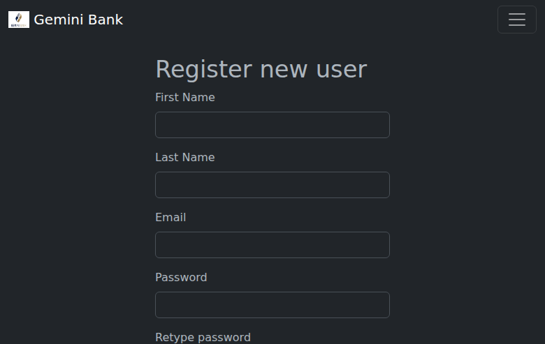
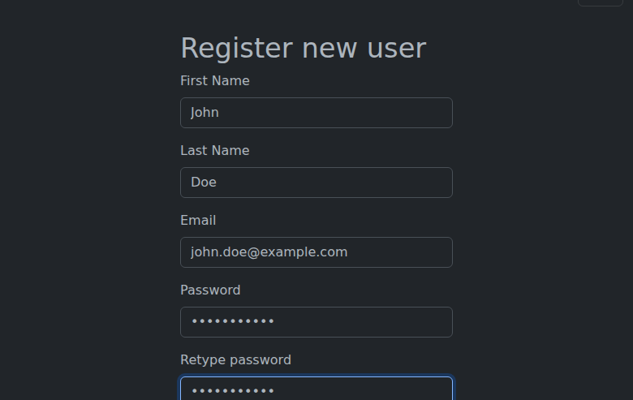
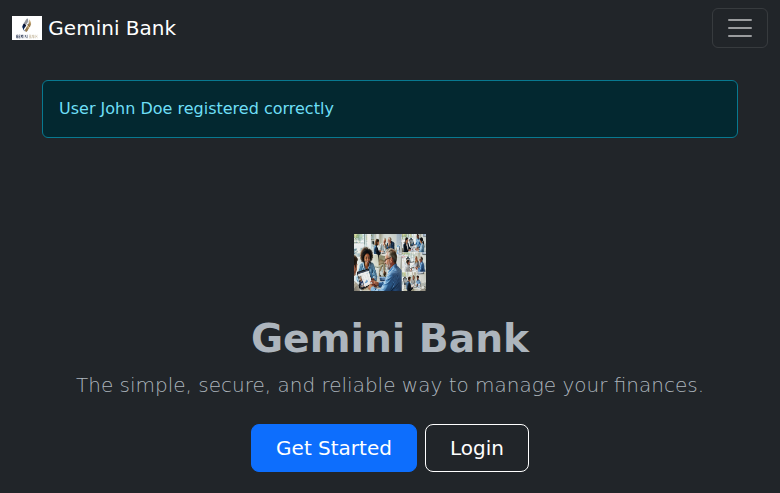
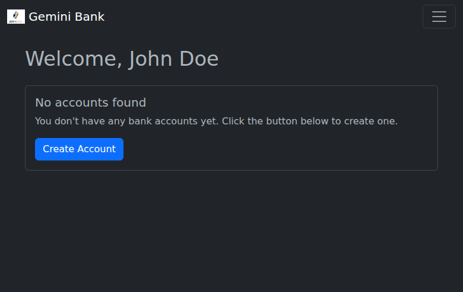
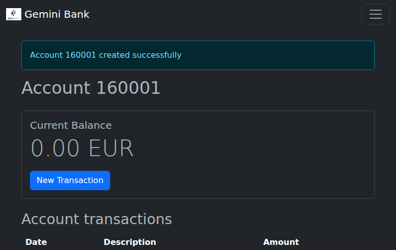
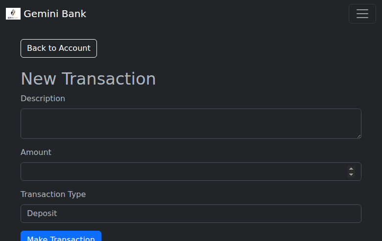
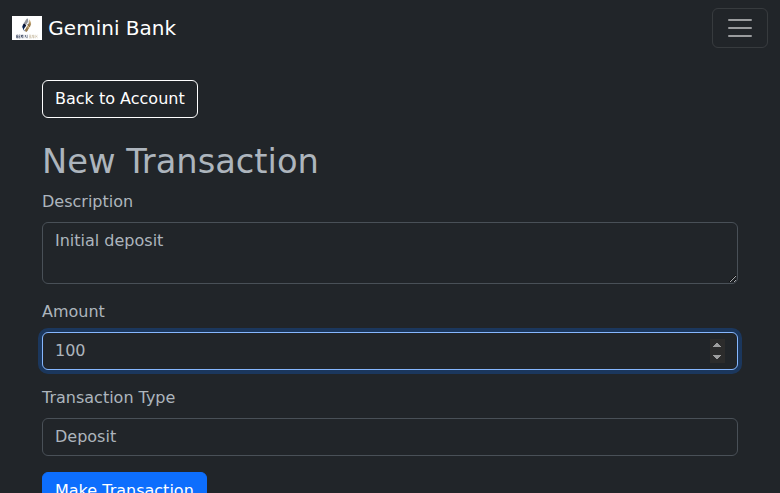
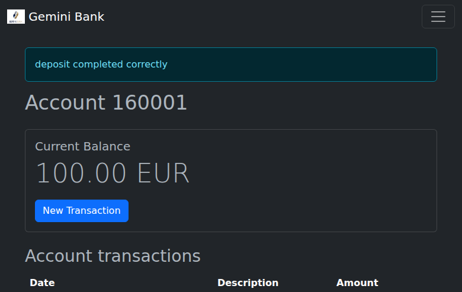

## [✅] Scenario 1: Register a New User

### Description of the scenario
1. Navigated to the home page.
2. Clicked on the "Get Started" link (documentation says "Register" button).
3. Filled the registration form with the following details:
    - First Name: John
    - Last Name: Doe
    - Email: john.doe@example.com
    - Password: password123
4. Clicked on the "Register user" button.
5. Verified that the user was registered successfully and a confirmation message was displayed.

### Screenshots

### Improvement Suggestions
- The documentation should be updated to mention the "Get Started" link instead of the "Register" button.
- The documentation should be updated to include the "Retype password" field in the registration form.

## [✅] Scenario 2: Create a New Bank Account

### Description of the scenario
1. Logged in with the newly created user.
2. Clicked on the "Create Account" button.
3. Verified that a new bank account was created successfully and the account details were displayed.

### Screenshots

### Improvement Suggestions
- None

## [✅] Scenario 3: Make a Deposit

### Description of the scenario
1. Clicked on the "New Transaction" button.
2. Filled the transaction form with the following details:
    - Description: Initial deposit
    - Amount: 100
    - Transaction Type: Deposit
3. Clicked on the "Make Transaction" button.
4. Verified that the deposit was made successfully and the account balance was updated.

### Screenshots

### Improvement Suggestions
- None

## [❌] Scenario 4: Make a Transfer

### Description of the scenario
1. Clicked on the "New Transaction" button.
2. Selected "Transfer" as the transaction type.
3. A new "Destination Account" field appeared, which is not mentioned in the documentation.
4. The test was blocked because there is no other account to transfer to.

### Screenshots
None

### Improvement Suggestions
- The documentation should be updated to include the "Destination Account" field in the transfer form.
- The application should provide a way to create multiple accounts for a user to be able to test the transfer functionality.
