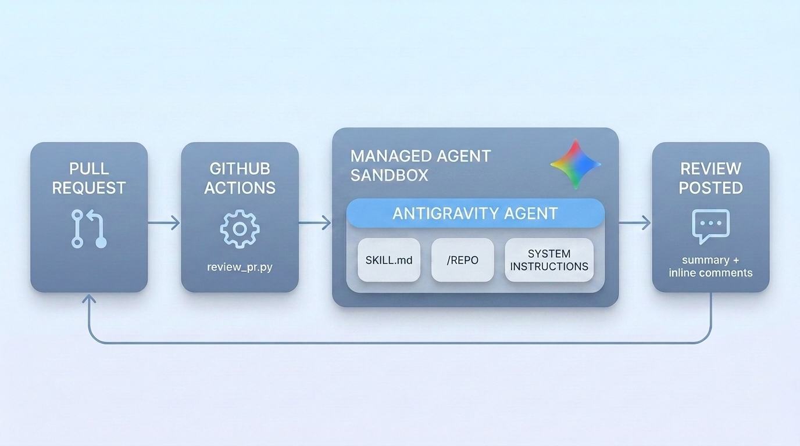

# GitHub PR Reviewer

Pull request reviews by a Gemini managed agent, triggered from GitHub Actions,
with pluggable review criteria.

When a pull request is opened or updated, a workflow invokes a hosted Gemini
managed agent that reviews the changes and posts the results on the PR: a
summary comment plus line-anchored review comments on the diff.

The review criteria live in a skill file (`skills/<name>/SKILL.md`), selected
with the `REVIEW_SKILL` variable. The base instruction and the findings schema
are shared across review types. Two skills ship with the tool:

| Skill | Reviews for |
|---|---|
| `security-review` (default) | vulnerabilities, correctness bugs, risky changes |
| `code-quality-review` | design, readability, tests, performance, consistency with the codebase |

To add a review type, create `skills/<my-review>/SKILL.md` (frontmatter `name`
and `description`, body with the focus areas, category names, severity
semantics, and rules) and set `REVIEW_SKILL: my-review`.



## How it works

1. The workflow runs `review_pr.py` with the PR number and the selected skill.
2. The script fetches the PR metadata and the per-file diff from the GitHub API.
3. It creates a managed-agent interaction. The sandbox is provisioned with the
   repository mounted at `/workspace/repo` through the `repository` environment
   source, and with the selected review skill mounted at
   `.agents/skills/<name>/SKILL.md` through an `inline` source (the runtime
   auto-registers skills under `.agents/skills/`; the same rubric also rides in
   the system instruction so it applies unconditionally). The agent runs
   `git fetch origin pull/<N>/head` plus a checkout to bring the mounted repo
   to the exact PR state: two git commands on an already-present working tree.
4. The prompt carries the PR diff; the mounted repository provides the
   surrounding code, specs, and docs the agent reads for context.
5. The agent gets an authenticated GitHub CLI through a shim wrapper mounted
   at `/workspace/bin/gh`, for read-only context gathering (linked issues,
   earlier review comments, CI check status). See "GitHub CLI inside the
   sandbox" below.
6. The agent returns findings as JSON matching the schema in `schema.py`; the
   script posts a summary comment and one line-anchored review comment per
   finding.
7. The summary comment carries a hidden state marker. The next run on the same
   PR reads it and resumes the conversation, so follow-up reviews remember the
   previous round. See "Follow-up reviews" below.

## Repository access and credentials

- The `repository` source mounts the repo's default branch at provision time
  (500 MB limit; GitHub is the documented provider). The PR state comes from
  fetching `refs/pull/<N>/head` inside the sandbox.
- For **private repositories**, the clone and fetch authenticate with a Basic
  header, `base64("x-access-token:<token>")`, which works for both the Actions
  `GITHUB_TOKEN` and classic PATs. The header is delivered through the
  `github.com` entry of the network allowlist as a `transform`: the egress
  proxy adds it outside the sandbox, so the token stays out of the VM's
  filesystem and environment. The script detects private repos from the
  repository's `private` flag; public repos run with a plain `github.com`
  allowlist entry.
- `transform` is a **list** of `{header: value}` objects. `google-genai >=
  2.10.0` types it this way and rejects a single dict client-side.

## Follow-up reviews

Reviews of the same PR build on each other. After posting, the tool appends a
hidden HTML marker to the summary comment with the interaction id, the
environment id, and the head SHA. The next run for the same PR and skill finds
the marker and resumes:

1. **Reused sandbox and conversation** (public repos): the previous
   environment id and `previous_interaction_id` are passed together, so the
   installed gh CLI and the cloned repo carry over.
2. **Fresh sandbox, resumed conversation**: a new environment with
   `previous_interaction_id`. This is the path for private repos, because a
   reused environment carries the previous job's expired token in its auth
   transform. It is also the fallback when the old sandbox is gone (sandboxes
   pause after 15 minutes idle and expire after 7 days).
3. **Cold start**: the fallback when the previous interaction is unavailable.

On a follow-up, the prompt tells the agent to report which previous findings
are fixed and which remain open, and to raise new findings only for the
current diff. Set `PERSIST=0` to run every review stateless.

## GitHub CLI inside the sandbox

The agent can consult GitHub for context beyond the code: linked issues,
earlier review comments, CI check status. It does this through a shim wrapper
(`bin/gh-shim.sh`, mounted at `/workspace/bin/gh`) that follows the token
injection pattern from
[Philipp Schmid's GitHub agent guide](https://www.philschmid.de/managed-agents-gh):

- The shim installs the gh CLI on first use (cached in the sandbox for
  environment reuse) and exports a **dummy** `GH_TOKEN` that satisfies the
  CLI's local auth check.
- The egress proxy injects the real job token at the network layer: `Bearer`
  on `api.github.com`, `Basic` on `github.com`. The token value never enters
  the sandbox.
- The prompt restricts usage to read-only context gathering; posting stays in
  the runner. Set `AGENT_GH=0` to remove the CLI and the `api.github.com`
  allowlist entry entirely.

**Capability note**: with the CLI enabled, code running in the sandbox can
call the GitHub API with the job token's permissions (the workflow grants
`contents: read` and `pull-requests: write`) for the duration of the job. The
token expires when the job ends. If you review PRs from untrusted
contributors, weigh this against the value of the extra context and set
`AGENT_GH=0` where it matters.

## Files

| File | Purpose |
|------|---------|
| `review_pr.py` | Orchestrator: PR context, managed-agent review, posting |
| `github_client.py` | GitHub REST helpers (PR and files, diff prompt, comments, Basic auth header) |
| `schema.py` | Base instruction shared by all review types + JSON findings contract |
| `skills/security-review/SKILL.md` | Security rubric (default) |
| `skills/code-quality-review/SKILL.md` | Maintainability rubric |
| `bin/gh-shim.sh` | GitHub CLI wrapper mounted into the sandbox |
| `pr-review.yml` | The Actions workflow, to copy into `.github/workflows/` |
| `requirements.txt` | `google-genai>=2.10.0`, `requests` |

## Setup (per target repo)

1. **Vendor the tool**: copy this folder to `tools/pr-reviewer/` in the repo.
2. **Add the workflow**: copy `pr-review.yml` to `.github/workflows/pr-review.yml`.
3. **Add one secret**: `GEMINI_API_KEY` (AI Studio key) under
   *Settings > Secrets and variables > Actions*. `GITHUB_TOKEN` is provided by
   Actions; the workflow's `permissions:` block grants `pull-requests: write`
   for the comments and `contents: read`.
4. Open a PR. The workflow also supports `workflow_dispatch` with `pr_number`
   and `review_skill` inputs, which lets you run two review types on the same
   PR.

To change the review type for automatic runs, edit `REVIEW_SKILL` in the
workflow, or duplicate the job with one skill each to post two reviews per PR.

## Testing locally

```bash
export GEMINI_API_KEY=... GITHUB_TOKEN=... \
       GITHUB_REPOSITORY=owner/repo PR_NUMBER=123 \
       REVIEW_SKILL=code-quality-review DRY_RUN=1
python review_pr.py   # prints the findings JSON, posts nothing
```

## Behavior details

- **Parsing**: the reply is parsed by stripping ```json fences, extracting the
  outermost JSON object, and escaping invalid backslash sequences (models echo
  regex and code into strings) before a retry parse.
- **Posting**: the summary lands as a conversation comment; each finding is
  posted as its own line-anchored review comment. Findings GitHub rejects with
  a 422 (line outside the diff) are grouped into one additional comment.
- **One-click fixes**: when a finding's fix is an exact replacement of the
  anchored line(s), the agent includes a `suggestion` field and the comment
  carries a GitHub suggested change: the PR author applies it with the
  **Commit suggestion** button. Multi-line replacements anchor a range via
  `start_line`. The skills instruct the agent to include a suggestion only
  when the full fix fits in the anchored lines, so the button always applies
  a complete fix.
- **Diff size**: the per-file diff in the prompt is capped at 20,000 characters
  (`build_diff_prompt`); files without a textual `patch` (binary or very large)
  are listed with a note. For truncated or patch-less files, the prompt
  instructs the agent to read the full change from the mounted repository with
  `git diff origin/<base>...HEAD -- <path>`.
- **Model**: the `BASE_AGENT` env var selects the agent id (default
  `antigravity-preview-05-2026`).

## Caveats

- Managed-agent reviews are advisory and non-deterministic. Treat findings as
  suggestions and verify them; the JSON schema constrains the shape of the
  output, and the judgment remains the model's.
- Cost: model tokens per review. A single interaction can consume 100k to 3M
  tokens per the documentation.
- On `pull_request` events from **forks**, Actions issues a read-only
  `GITHUB_TOKEN`, so posting comments fails. Run reviews on same-repo branches,
  or switch the trigger to `pull_request_target` after evaluating its security
  implications.

## Sources

- https://ai.google.dev/gemini-api/docs/agents
- https://ai.google.dev/gemini-api/docs/agent-environment (repository source, allowlist, private-repo auth)
- https://ai.google.dev/gemini-api/docs/custom-agents
